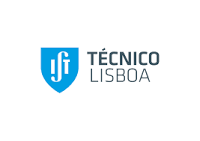

[![Contributors][contributors-shield]][contributors-url]
[![Forks][forks-shield]][forks-url]
[![Stargazers][stars-shield]][stars-url]
[![Issues][issues-shield]][issues-url]
[![MIT License][license-shield]][license-url]

<!-- PROJECT LOGO -->
 

  <h1 align="center">Autonomous Shared Vehicle Transportation System</h1>

  

    A project for the autonomous scheduling of self-driving vehicles with optimization. This project is submitted as part of the evaluation of the Artificial Intelligence and Decision Systems course in the Bologna Master in Electrical and Computer Engineering, Instituto Superior Técnico, Lisboa [a member of the consortium of the Marine and Maritime Intelligent Robotics (MIR) Master].
     
    
    .
    
     
    <a href="https://github.com/olanrewajufarooq/SharedVehicleScheduling">View Project Files »</a>
     
  

## Description

.

### Tasks Completed in the project include:

.

## Software Used

- Python

## Dependencies

- Search

## Usage

.

<!-- CONTACT -->
## Contact Contributors

* Ayesha Aslam
* Farooq Olanrewaju - olanrewajufarooq@yahoo.com
* Md Sazidur

<strong>Supervisor</strong>: Rodrigo Ventura, <i>Assistant Professor of Electrical and Computer Engineering, IST</i>.

(<a href="#readme-top">back to top</a>)

<!-- MARKDOWN LINKS & IMAGES -->
<!-- https://www.markdownguide.org/basic-syntax/#reference-style-links -->
[contributors-shield]: https://img.shields.io/github/contributors/olanrewajufarooq/SharedVehicleScheduling.svg?style=for-the-badge
[contributors-url]: https://github.com/olanrewajufarooq/SharedVehicleScheduling/graphs/contributors
[forks-shield]: https://img.shields.io/github/forks/olanrewajufarooq/SharedVehicleScheduling.svg?style=for-the-badge
[forks-url]: https://github.com/olanrewajufarooq/SharedVehicleScheduling/network/members
[stars-shield]: https://img.shields.io/github/stars/olanrewajufarooq/SharedVehicleScheduling.svg?style=for-the-badge
[stars-url]: https://github.com/olanrewajufarooq/SharedVehicleScheduling/stargazers
[issues-shield]: https://img.shields.io/github/issues/olanrewajufarooq/SharedVehicleScheduling.svg?style=for-the-badge
[issues-url]: https://github.com/olanrewajufarooq/SharedVehicleScheduling/issues
[license-shield]: https://img.shields.io/github/license/olanrewajufarooq/SharedVehicleScheduling.svg?style=for-the-badge
[license-url]: https://github.com/olanrewajufarooq/SharedVehicleScheduling/blob/main/LICENSE
